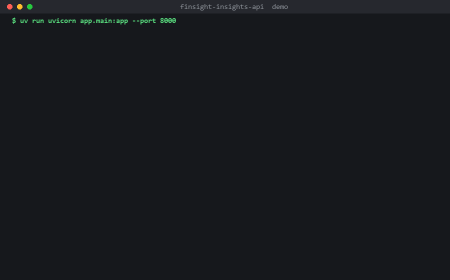

# FinSight Insights API

A market-data and financial-coaching service for beginners, built as the
FlyRank Backend AI Engineering capstone ("Your 10x Solution").

FinSight is a financial-literacy app for Indian college students, built by me
with a college group. The React Native app is the group's work; **this
repository is the backend service I own** - the part that holds the AI key,
collects Indian-market data, and turns it into something a beginner can use. It
has been rebuilt here as a standalone, hardened, runnable-by-a-stranger service.

The full write-up is in
[`My 10x Solution - Balaji Thukuntala.md`](My%2010x%20Solution%20-%20Balaji%20Thukuntala.md).



_The 5-minute demo path, against the live Gemini API: market levels, AI
commentary, a watchlist, personalised coaching, a generated PDF digest, and the
AI cost log._

## What it does

- **`GET /market/pulse`** - current NIFTY 50, SENSEX, gold, USD/INR, politely
  fetched from Yahoo Finance with a stale-fallback when Yahoo throttles.
- **`GET /market/insight`** - two beginner-level explanations of the day's
  biggest moves, from Gemini. Identical for every user, so one call is cached
  for 15 minutes and a cron job keeps that cache warm.
- **`POST /coach/advisor`** - a coaching note plus three quests, from the
  user's own spending, budgets and goals. Auth + a daily AI quota.
- **`POST /learn/flashcards`** - five study flashcards from a learning module.
- **`GET/POST/DELETE /watchlist`** - the tickers a user follows (persisted).
- **`POST /reports/weekly-digest`** - render this week's digest as a PDF
  (market pulse + AI commentary + watchlist), stored on disk, served by link.
  A weekly cron job generates it for every user in advance.
- **`GET /usage`** - this user's AI spend from the cost log, against the quota.

## Run it

### Deploy (free tier, no card)

A [`render.yaml`](render.yaml) blueprint is included. On the Render dashboard:
New -> Blueprint -> pick this repo, then set `GEMINI_API_KEY` in the service's
Environment tab. The free tier has no disk, so the SQLite file is ephemeral and
`SEED_ON_START=true` reseeds the demo watchlist on each cold start.

### Option A: Docker (one command)

```bash
docker compose up
```

Starts the API on <http://localhost:8000> with the scheduler running. Runs in
LLM stub mode unless you pass a key:

```bash
GEMINI_API_KEY=your-key LLM_STUB=false docker compose up
```

### Option B: local

```bash
uv sync
cp .env.example .env            # works as-is; add GEMINI_API_KEY for real AI
uv run python -m app.seed       # demo watchlist for the demo user
uv run uvicorn app.main:app --port 8000
```

A free Gemini key (no card) is at <https://aistudio.google.com/apikey>. Without
one, set `LLM_STUB=true` and every AI route returns a placeholder so the rest of
the service still works.

## 5-minute demo path

`DEV_AUTH` is on, so the demo user's bearer token is `dev-demo-token`.

```bash
BASE=http://localhost:8000
AUTH='Authorization: Bearer dev-demo-token'

# 1. live Indian market levels (no auth, note the X-Cache header)
curl -i $BASE/market/pulse

# 2. AI commentary on the biggest moves (cached 15 min)
curl -s $BASE/market/insight | python -m json.tool

# 3. follow a ticker (persisted)
curl -s -X POST $BASE/watchlist -H "$AUTH" -H 'Content-Type: application/json' \
  -d '{"symbol":"RELIANCE.NS","label":"Reliance"}'
curl -s $BASE/watchlist -H "$AUTH"

# 4. personalised coaching from your own data (auth + quota)
curl -s -X POST $BASE/coach/advisor -H "$AUTH" -H 'Content-Type: application/json' \
  -d '{"score":620,"transactions":[{"amount":900,"category":"food"}],
       "budgets":[{"category":"food","current_spend":900,"monthly_limit":800}]}'

# 5. generate this week's PDF digest, then download it
curl -s -X POST $BASE/reports/weekly-digest -H "$AUTH"
curl -s -o digest.pdf $BASE/reports/1/file -H "$AUTH"   # opens as a real PDF

# 6. see what the AI has cost today
curl -s $BASE/usage -H "$AUTH"
```

## The 7 program concepts, and where they live

| Concept | Where |
|---------|-------|
| API endpoints | `app/routes/` - typed models, `400` on bad input before any work, `401/404/409/429/502` used correctly |
| Database | `app/db.py` (SQLite): `llm_calls` (cost log + quota counter), `reports` (PDF metadata), `watchlist` - all survive a restart |
| Authentication | `app/security.py` - Firebase ID-token verification (audience + issuer), plus a `DEV_AUTH` bearer mode so a stranger can run it with no Firebase project |
| Background / cron jobs | `app/jobs.py` (APScheduler): `*/15 * * * *` pre-warms the insight cache, `0 8 * * 1` renders weekly digests |
| LLM integration + cost log | `app/llm.py` - one narrow Gemini job per endpoint, output schema-validated with a single repair retry, every call logged with tokens / duration / repairs |
| Reporting (PDF) | `app/reports.py` - HTML digest printed to PDF by a headless browser, stored on disk, served by `FileResponse` link (never bytes in JSON) |
| Caching | `app/cache.py` - in-process TTL cache, per-response-type lifetimes, `X-Cache: HIT/MISS` header; the market commentary is one call for all users |

Additional (stretch): a containerized stack (`docker compose up`), a test suite
covering the scary cases (`uv run pytest`), and a per-user daily AI quota
enforced at the boundary with a `429`.

## Tests

```bash
uv run pytest
```

10 tests, no network: auth required and rejected, watchlist persists across a
restart, input validation is `400`, the LLM stub logs a cost row, the repair
retry fires on malformed model JSON, the quota returns `429`, and the digest
PDF is stored and served by link and never as JSON bytes.

## Layout

```
app/
  main.py       FastAPI app, routers, error handlers, scheduler lifecycle
  config.py     every setting, from the environment
  db.py         SQLite schema + connection
  cache.py      the TTL cache
  security.py   auth: Firebase token or DEV_AUTH bearer
  quota.py      per-user daily AI quota
  llm.py        Gemini call + parse + validate + repair + cost log
  insight.py    market commentary (shared by the route and the cron job)
  market.py     polite Yahoo Finance quotes with stale fallback
  reports.py    digest data + HTML + PDF render + store
  jobs.py       APScheduler cron jobs
  schemas.py    request/response models
  seed.py       demo watchlist
  routes/       market, coach, learn, watchlist, reports, admin
tests/test_api.py
```

## Future ideas

Kept out of scope on purpose (the non-goal from milestone M1): the React Native
front end, any brokerage or real-money feature, and a Postgres move. If those
matter later they go here, not into this build.
